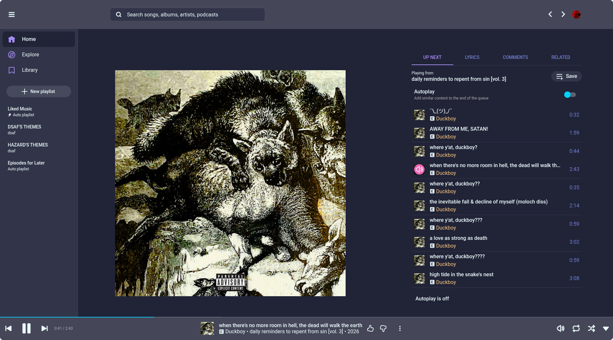
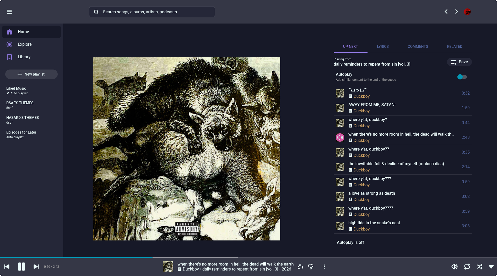
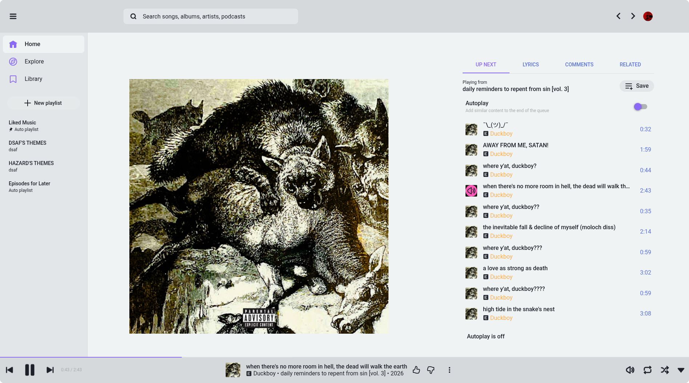

<!-- DO NOT CHANGE THIS -->

  

  Eldritch is a community-driven dark theme inspired by Lovecraftian horror. With tones from the dark abyss and an emphasis on green and blue, it caters to those who appreciate the darker side of life.

Main Theme repo can be found [here](https://github.com/eldritch-theme/eldritch)

### Showcase

<!-- Your screenshots should go here -->

    
🦑 Cthulhu (Default)

    

    
🌀 Abyss (Darker)

    

    
🌅 Dusk (Light)

    

### Installation

<!--
Avoid instructing users to execute shell commands. Prefer plain text instructions unless commands are strictly necessary (for example, when using a dedicated installation script).

Prefer release downloads or links to files/directories within the repository over Git commands, curl, wget, or similar download methods.

Build instructions should be documented separately (for example, in BUILD.md).
-->

1. Download the CSS file of your preferred palette in [themes](themes)

#### [Pear Desktop](https://github.com/pear-devs/pear-desktop)

2. Navigate to `Options > Visual Tweaks > Theme > Import custom CSS file`
3. Choose your downloaded file

#### [Youtube Music Desktop App (ytmdesktop)](https://ytmdesktop.github.io/)

2. Navigate to `Settings > Appearance` then enable Custom CSS
3. Choose your downloaded file in Custom CSS file path

### Acknowledgments

- [dracula](https://github.com/dracula/youtube-music-desktop) & [catppuccin](https://github.com/catppuccin/youtubemusic) for the approach this project is based on